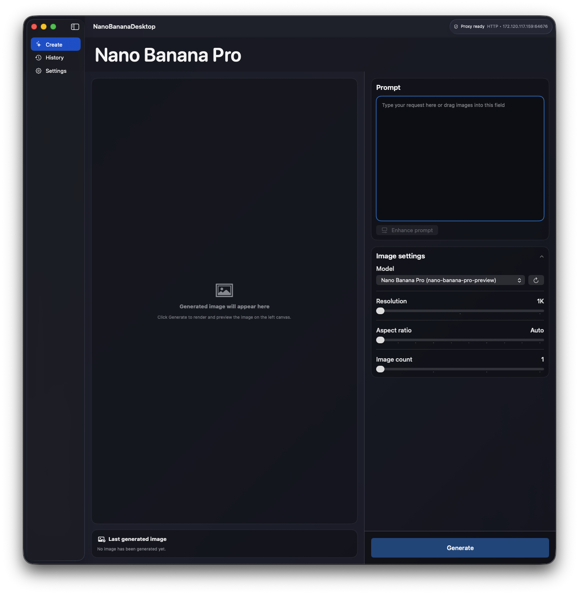
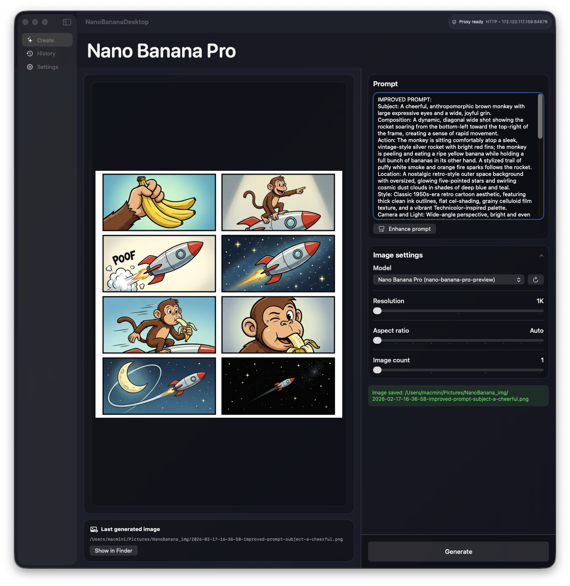

# NanoBananaDesktop

Native macOS desktop app for image generation and image-based prompt workflows using Google Gemini image-capable models, with proxy-aware networking and local history.

## Screenshots



## Features
- Image generation and editing (prompt + optional image references).
- Batch generation: 1 to 4 images per request.
- Prompt enhancement and prompt-from-image flow.
- Drag & drop attachments with `@mention` insertion.
- Proxy-first networking (HTTP/HTTPS/SOCKS5) with optional direct fallback.
- Resolution, aspect ratio, and model selection from available Gemini models.
- Local history with reuse, copy actions, thumbnails, and fullscreen preview.
- RU/EN localization and configurable app settings.

## Requirements
- macOS 13+
- Xcode (for app build/run)
- Swift 6 toolchain (`swift test`)
- Gemini API key

## Build and run

### Swift Package (developer mode)
```bash
swift run NanoBananaDesktop
```

### Xcode (project run)
1. Open `NanoBananaDesktop/NanoBananaDesktop.xcodeproj`
2. Select target `NanoBananaDesktop`
3. Build and run (`Cmd+R`)

### Build standalone `.app` (local bundle)
Use this if you want a convenient app bundle in the project root.

Recommended (one command, always includes the canonical app icon):
```bash
bash scripts/build_local_app.sh
```

This creates:
- `NanoBananaDesktop.app` in the repository root
- ad-hoc signature for local launch
- embedded icon from `NanoBananaDesktop/Resources/AppIcon.icns` (if file exists)

Manual equivalent steps:

1. Build release binary:
```bash
swift build -c release
```

2. Create app bundle structure and copy executable/resources:
```bash
BIN_DIR="$(swift build -c release --show-bin-path)"
APP_NAME="NanoBananaDesktop.app"
APP_PATH="$PWD/$APP_NAME"

rm -rf "$APP_PATH"
mkdir -p "$APP_PATH/Contents/MacOS" "$APP_PATH/Contents/Resources"
cp "$BIN_DIR/NanoBananaDesktop" "$APP_PATH/Contents/MacOS/NanoBananaDesktop"
chmod +x "$APP_PATH/Contents/MacOS/NanoBananaDesktop"

# Copy SwiftPM resource bundle (localizations, etc.)
RESOURCE_BUNDLE="$(find "$(dirname "$BIN_DIR")" -maxdepth 3 -type d -name '*NanoBananaDesktop*.bundle' | head -n1)"
if [[ -n "$RESOURCE_BUNDLE" ]]; then
  cp -R "$RESOURCE_BUNDLE" "$APP_PATH/Contents/Resources/"
fi
```

3. Write `Info.plist`:
```bash
cat > "$APP_PATH/Contents/Info.plist" <<'PLIST'
<?xml version="1.0" encoding="UTF-8"?>
<!DOCTYPE plist PUBLIC "-//Apple//DTD PLIST 1.0//EN" "http://www.apple.com/DTDs/PropertyList-1.0.dtd">
<plist version="1.0">
<dict>
  <key>CFBundleName</key>
  <string>NanoBananaDesktop</string>
  <key>CFBundleDisplayName</key>
  <string>NanoBananaDesktop</string>
  <key>CFBundleIdentifier</key>
  <string>com.nanobanana.desktop.local</string>
  <key>CFBundleVersion</key>
  <string>1</string>
  <key>CFBundleShortVersionString</key>
  <string>1.0</string>
  <key>CFBundlePackageType</key>
  <string>APPL</string>
  <key>CFBundleExecutable</key>
  <string>NanoBananaDesktop</string>
  <key>LSMinimumSystemVersion</key>
  <string>13.0</string>
  <key>NSPrincipalClass</key>
  <string>NSApplication</string>
  <key>NSHighResolutionCapable</key>
  <true/>
</dict>
</plist>
PLIST
```

4. (Optional but recommended) Ad-hoc sign local bundle:
```bash
codesign --force --deep --sign - "$APP_PATH"
```

5. Launch app:
```bash
open "$APP_PATH"
```

Notes:
- `NanoBananaDesktop.app` is ignored by git (`.gitignore`).
- Ad-hoc signing is enough for local use on your Mac.
- For distribution to other Macs, use proper Developer ID signing + notarization.
- Canonical icon source for builds: `NanoBananaDesktop/Resources/AppIcon.icns`.

## Tests
```bash
swift test
```

## Runtime data (local, not in repo)
Application config and history are stored in:

`~/Library/Application Support/NanoBananaDesktop/`

Files:
- `config.json` (includes API key / proxy settings)
- `history.json`

These files are intentionally excluded from git.

## Security and secrets
- Never commit API keys, proxy passwords, `.env` files, certificates, or private keys.
- `pre-commit` + CI release-guard checks enforce this repository policy.
- See `SECURITY.md` for vulnerability reporting and disclosure.

## Repository hygiene
This repository excludes:
- local build artifacts (`.build`, `.xcodebuild`, `.app`)
- local user state (`xcuserdata`, `.DS_Store`)
- local logs and temporary files

See `.gitignore` and `scripts/release_guard.sh` for enforced rules.

## License
MIT — see `LICENSE`.
